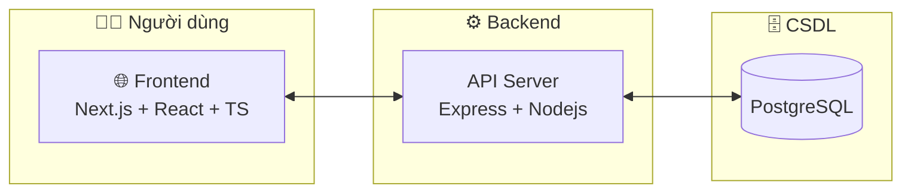

<h1 align="center">Work Assignment System 👋</h1>

# 📌 Work Assignment System

Ứng dụng web quản lý và phân công công việc theo **phòng ban** và **cá nhân**, hỗ trợ tổ chức tối ưu quy trình làm việc, giám sát tiến độ và nâng cao hiệu quả làm việc nhóm.  

---

## 🏗️ Kiến trúc hệ thống



## ✨ Chức năng hệ thống

### 1. Tạo và phân công công việc
- Quản lý hoặc người có quyền có thể tạo nhiệm vụ với chi tiết: **tên công việc, mô tả, thời hạn, mức độ ưu tiên**.  
- Phân công công việc cho **phòng ban** hoặc **cá nhân**, cho phép chỉ định nhiều người tham gia.  

### 2. Quản lý danh sách công việc
- Hiển thị danh sách công việc kèm: **người chịu trách nhiệm, trạng thái, hạn chót**.  
- Tìm kiếm, lọc, sắp xếp công việc theo: **phòng ban, thời hạn, ưu tiên, trạng thái**.  

### 3. Theo dõi tiến độ công việc
- Theo dõi tiến độ thực hiện với: **% hoàn thành, milestones, báo cáo tiến độ**.  
- Cập nhật trạng thái công việc **theo thời gian thực**, ghi nhận thay đổi trong quá trình thực hiện.  

### 4. Quản lý thời hạn và nhắc nhở
- Thiết lập **thông báo, nhắc nhở** khi công việc sắp đến hạn hoặc quá hạn.  
- Gửi thông báo qua **email hoặc hệ thống** khi có thay đổi quan trọng.  

### 5. Hợp tác và trao đổi thông tin
- Chức năng **chat/thảo luận trực tiếp** trên mỗi công việc.  
- Đính kèm **tài liệu, file, tài nguyên** liên quan ngay trong hệ thống.  

### 6. Báo cáo và phân tích
- Xuất báo cáo theo **phòng ban / cá nhân**: công việc đã xong, đang làm, bị trì hoãn.  
- Phân tích hiệu suất theo: **thời gian hoàn thành, khối lượng, hiệu quả làm việc**.  

### 7. Quản lý người dùng và phân quyền
- Phân quyền theo vai trò: **Admin, Trưởng phòng, Nhân viên**.  
- Quản lý thành viên phòng ban, điều chỉnh quyền khi cần thiết.  

### 8. Lưu trữ và tra cứu công việc
- Lưu trữ công việc đã hoàn thành để tra cứu lại khi cần.  
- Tìm kiếm, lọc công việc theo: **thời gian, người thực hiện, phòng ban, loại công việc**.  

---

## 🛠️ Công nghệ sử dụng

<div align="center">
  
  
  
  
  <br>
  
  
  
  
</div>

- **Frontend**: Next.js + React + TypeScript  
- **Backend**: Express.js (trên nền tảng Node.js) + Next.js API Routes  
- **Database**: PostgreSQL  
- **Auth**: JWT / OAuth2  
- **Containerization**: Docker + Docker Compose  

---

## 📂 Cấu trúc thư mục

    project-root/
    │── frontend/ # Next.js + TypeScript (UI)
    │── backend/ # Express (trên nền tảng Node.js) + Next.js API server
    │── docker-compose.yml # Docker Compose config
    │── LICENSE
    │── README.md

---

## ⚙️ Cài đặt & Chạy dự án

### 1. Yêu cầu

- [Docker](https://www.docker.com/)  
- [Docker Compose](https://docs.docker.com/compose/)  

### 2. Clone dự án
```

git clone https://github.com/sieunguyen28/Major_Project.git
cd Major_Project

```

### 3. Cấu hình biến môi trường

📌 File .env cho backend:

    DATABASE_URL=postgresql://user:123456789@db:5432/workdb
    JWT_SECRET=your_jwt_secret
    PORT=5000

📌 File .env.local cho frontend:

    NEXT_PUBLIC_API_URL=http://localhost:5000/api

### 4. Chạy ứng dụng bằng Docker
```

docker-compose up --build

```
Ứng dụng sẽ chạy tại:

🌐 Frontend: http://localhost:3000

⚙️ Backend API: http://localhost:5000

🗄️ PostgreSQL: localhost:5432

## 🚀 Hướng phát triển

Tích hợp realtime notification (Socket.io).

Tích hợp chat nội bộ nâng cao.

Dashboard trực quan với biểu đồ, báo cáo.

## 📄 Giấy phép

Phát hành theo giấy phép MIT.

